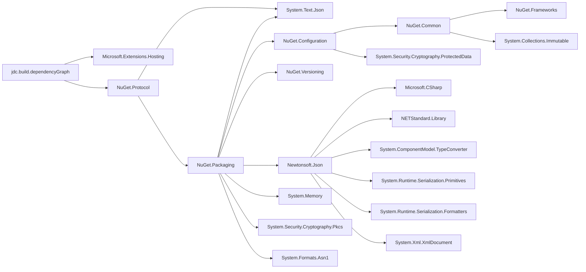

# jdc.build.dependencyGraph

## Usage

```
docker run --rm -it -v "my/project/root/path:/src" ghcr.io/j-dc/jdc-build-dependencygraph:latest  --projectFile "/src/MyProject/MyProject.csproj"
```


## Minimum expected project structure
```
📂root
 |--📂MyProject
 |   |--📝MyProject.csproj
 |--📝MyProject.sln
 |--📝Nuget.config
```

__A local`Nuget.config` is required.__


Nuget.config example:

```xml
<?xml version="1.0" encoding="utf-8"?>
<configuration>
  <packageSources>
    <clear />
    <add key="NuGet.org" value="https://api.nuget.org/v3/index.json" protocolVersion="3" />
  </packageSources>

  <packageSourceMapping>
    <packageSource key="NuGet.org">
      <package pattern="*" />
    </packageSource>
  </packageSourceMapping>
</configuration>
```

## Exaple output
The ouput when running on this project:

```text
graph LR
        jdc.build.dependencyGraph --> Microsoft.Extensions.Hosting
        jdc.build.dependencyGraph --> NuGet.Protocol
        NuGet.Protocol --> NuGet.Packaging
        NuGet.Protocol --> System.Text.Json
        NuGet.Packaging --> NuGet.Configuration
        NuGet.Packaging --> NuGet.Versioning
        NuGet.Packaging --> Newtonsoft.Json
        NuGet.Packaging --> System.Memory
        NuGet.Packaging --> System.Text.Json
        NuGet.Packaging --> System.Security.Cryptography.Pkcs
        NuGet.Packaging --> System.Formats.Asn1
        NuGet.Configuration --> NuGet.Common
        NuGet.Configuration --> System.Security.Cryptography.ProtectedData
        NuGet.Common --> NuGet.Frameworks
        NuGet.Common --> System.Collections.Immutable
        Newtonsoft.Json --> Microsoft.CSharp
        Newtonsoft.Json --> NETStandard.Library
        Newtonsoft.Json --> System.ComponentModel.TypeConverter
        Newtonsoft.Json --> System.Runtime.Serialization.Primitives
        Newtonsoft.Json --> System.Runtime.Serialization.Formatters
        Newtonsoft.Json --> System.Xml.XmlDocument
```

REsulting in this mermaid diagram:



